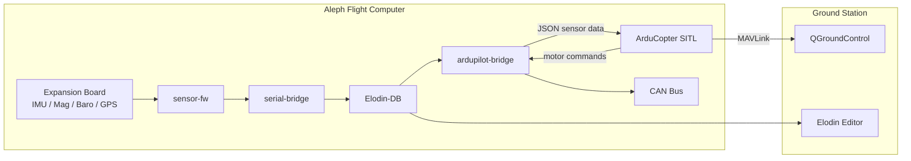

# Architecture

## System Overview



The Aleph runs the full flight stack as NixOS systemd services. Physical sensors feed through Elodin's `sensor-fw` and `serial-bridge` into **Elodin-DB**, the shared telemetry database. The **ardupilot-bridge** (Rust) subscribes to DB entities, converts sensor data to ArduPilot's JSON SITL protocol, and forwards motor commands back to CAN ESCs. **ArduCopter SITL** handles all flight control logic.

From the ground station, **Elodin Editor** provides real-time telemetry visualization, and **QGroundControl** connects via MAVLink for mission planning and control.

## Deployment Modes

### Default (full onboard stack)

All sensors are live. The ardupilot-bridge reads from the local Elodin-DB and optionally exposes an HITL port for external physics injection.

```bash
./deploy.sh -h <aleph-ip> -u root
```

### Sim-HITL (physics simulation on laptop)

The ardupilot-bridge points at the laptop's Elodin-DB instead of the local one. A Python physics simulation (`sim/sim-hitl/`) writes synthetic sensor data to the same DB entities that real hardware would populate. The bridge is completely unaware a simulation is involved -- it sees the identical schema.

```bash
./deploy.sh -c sim-hitl -h <aleph-ip> -u root
elodin run sim/sim-hitl/main.py   # on laptop
```

## Data Flow

### DB Entity Schema

All sensor data flows through named Elodin-DB entities. The ardupilot-bridge subscribes to these regardless of whether data comes from real hardware or the simulator.

| Entity | Contents | Source (default) | Source (sim-hitl) |
|---|---|---|---|
| `imu` | gyro, accel, mag (f32) | BMI270 / BMM350 via sensor-fw | Physics sim |
| `ublox` | GPS UBX-NAV-PVT integers | u-blox M10Q or M9N via sensor-fw | Physics sim |
| `qmc5883l` | External compass (i16 raw) | QMC5883L via sensor-fw | Not simulated |
| `aleph` | MEKF attitude quaternion, baro | MEKF + BMP390 via sensor-fw | Physics sim |
| `ardupilot` | Motor commands, PWM | ardupilot-bridge (from ArduCopter) | Same |

### Bridge Data Path

1. **IMU** (~760 Hz): `imu.gyro` / `imu.accel` -- FLU-to-FRD conversion, fed to ArduPilot JSON packet at IMU rate.
2. **GPS** (~5 Hz): `ublox.*` -- UBX integers converted to NED position/velocity relative to home, cached and included in every JSON packet.
3. **Magnetometer** (~100 Hz): `qmc5883l.mag` -- raw i16 LSB converted to body-frame Gauss for tilt-compensated compass.
4. **Attitude** (high rate): `aleph.q_hat` -- MEKF quaternion converted to NED Euler angles, blended with GPS heading at speed.
5. **Motors** (servo rate): ArduPilot servo output parsed from UDP, written to `ardupilot.motor_command` / `ardupilot.motor_pwm`, and forwarded to CAN ESCs.

## Project Structure

```
aleph-ardupilot/
├── flake.nix                        # NixOS system configs (default + sim-hitl)
├── flake.lock
├── deploy.sh                        # OTA deployment script
├── nix/
│   ├── modules/
│   │   ├── arducopter.nix           # ArduCopter SITL systemd service
│   │   ├── ardupilot-bridge.nix     # Sensor bridge systemd service
│   │   └── can.nix                  # SocketCAN interface setup
│   └── pkgs/
│       ├── arducopter.nix           # ArduCopter SITL build derivation
│       ├── ardupilot-bridge.nix     # Rust bridge build derivation
│       └── fake-git.nix             # Stub git for Nix sandbox builds
├── src/
│   ├── ardupilot-bridge/            # Rust: Elodin-DB <-> ArduPilot <-> CAN
│   ├── ardupilot-defaults.param     # ArduPilot parameter defaults
│   └── ardupilot/                   # ArduPilot submodule (reference)
├── sim/
│   └── sim-hitl/                    # Python/Elodin physics sim (runs on laptop)
│       ├── main.py                  # Simulation entry point
│       ├── gps.py                   # GPS sensor model (ENU -> LLA + noise)
│       ├── sensors.py               # IMU sensor model
│       ├── sim.py                   # Quadcopter physics (motors, drag, gravity)
│       └── config.py                # EDU-450 physical parameters
├── ssh/
│   ├── aleph-key                    # SSH private key (for deployments)
│   └── aleph-key.pub               # SSH public key (installed on Aleph)
└── context/                         # Design docs and datasheets
```

## Key Components

### ardupilot-bridge (Rust)

`src/ardupilot-bridge/` -- Subscribes to Elodin-DB sensor entities, assembles ArduPilot's JSON SITL sensor packets, and sends them over UDP. Receives servo output from ArduPilot and writes motor telemetry back to the DB. Also forwards motor commands to CAN ESCs via SocketCAN.

Background subscription tasks run on dedicated threads for each sensor source (IMU, GPS, QMC5883L, MEKF attitude), each with independent reconnect logic.

### sim-hitl (Python / Elodin)

`sim/sim-hitl/` -- A 6-DOF quadcopter physics simulation using the Elodin physics engine. Runs on the developer's laptop and writes sensor data to an Elodin-DB that the Aleph's ardupilot-bridge connects to remotely.

The simulation writes to the same `imu`, `ublox`, and `aleph` DB entities as real hardware. GPS noise is injected in the post-step callback using numpy PRNG (avoiding JAX JIT issues), and values are converted to UBX integer format before writing.

### ArduCopter SITL

ArduPilot's ArduCopter compiled for SITL (Software-In-The-Loop) mode, running as a systemd service on the Aleph. Receives sensor data from the bridge via the JSON backend and outputs motor commands via UDP servo packets.

### Elodin-DB

The shared telemetry database that decouples all components. Sensors write, the bridge reads, and the Elodin Editor can connect remotely for live visualization. In sim-hitl mode, the DB runs on the laptop; in default mode, it runs on the Aleph.
