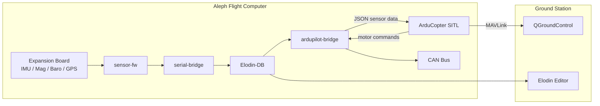

# Aleph ArduPilot

ArduCopter flight controller running on the [Elodin Aleph](https://github.com/elodin-sys/elodin/tree/main/aleph) flight computer, with a Rust sensor bridge connecting Elodin-DB telemetry to ArduPilot SITL and CAN ESC output.

## Architecture



Two deployment configurations are provided:

- **default** -- Full onboard stack. The ardupilot-bridge reads from the local Elodin-DB and exposes an HITL port for optional external physics simulation.
- **sim-hitl** -- Sim-in-the-loop. The ardupilot-bridge points at the laptop's Elodin-DB, where a Python physics sim feeds synthetic sensor data. Real hardware sensors still stream to the Aleph's local Elodin-DB.

## Prerequisites

- **[Determinate Systems Nix](https://determinate.systems/nix-installer/)** installed on your development machine
- **An Aleph flight computer** with the base NixOS image flashed
- **Network connectivity** to your Aleph (WiFi or USB ethernet)
- **SSH access** configured (password or key-based)

```bash
curl --proto '=https' --tlsv1.2 -sSf -L https://install.determinate.systems/nix | sh -s -- install
```

## Project Structure

```
aleph-ardupilot/
├── flake.nix                        # NixOS system configs (default + sim-hitl)
├── flake.lock
├── deploy.sh                        # OTA deployment script
├── nix/
│   ├── modules/
│   │   ├── arducopter.nix           # ArduCopter SITL systemd service
│   │   ├── ardupilot-bridge.nix     # Sensor bridge systemd service
│   │   └── can.nix                  # SocketCAN interface setup
│   └── pkgs/
│       ├── arducopter.nix           # ArduCopter SITL build derivation
│       ├── ardupilot-bridge.nix     # Rust bridge build derivation
│       └── fake-git.nix             # Stub git for Nix sandbox builds
├── src/
│   ├── ardupilot-bridge/            # Rust: Elodin-DB <-> ArduPilot <-> CAN
│   ├── ardupilot-defaults.param     # ArduPilot parameter defaults
│   └── ardupilot/                   # ArduPilot submodule (reference)
├── sim/
│   ├── sim-hitl/                    # Python physics sim (runs on laptop)
│   └── ardupilot-hitl/              # Elodin HITL simulation script
├── ssh/
│   ├── aleph-key                    # SSH private key
│   └── aleph-key.pub                # SSH public key
└── context/                         # Design docs and datasheets
```

## Building

Test that the system compiles:

```bash
nix build --accept-flake-config .#packages.aarch64-linux.toplevel --show-trace
```

Build the sim-hitl variant:

```bash
nix build --accept-flake-config .#packages.aarch64-linux.sim-hitl --show-trace
```

## Deploying

### Default (full onboard stack)

```bash
./deploy.sh -h <aleph-ip> -u root
```

### Sim-HITL (physics sim on laptop)

```bash
./deploy.sh -c sim-hitl -h <aleph-ip> -u root
```

The deploy script auto-detects whether you have an aarch64-linux builder available. If not, it falls back to building on the Aleph itself (slower). Use `--no-aleph-builder` to force local/configured builder usage.

## Development

Enter the ground station devshell for Elodin tools and QGC:

```bash
nix develop --accept-flake-config
```

This provides:

- `elodin editor <aleph-ip>:2240` -- live telemetry viewer
- `elodin run sim/ardupilot-hitl/main.py` -- HITL simulation driver
- `qgroundcontrol` -- GCS for ArduPilot (Linux only)

## Initial Aleph Setup

### Connecting via Serial (FTDI)

1. Connect a USB cable to the Aleph's FTDI debug port
2. Find the serial device:
   ```bash
   ls /dev/tty.usbserial-*  # macOS
   ls /dev/ttyUSB*          # Linux
   ```
3. Connect with screen:
   ```bash
   screen /dev/tty.usbserial-XXXXX 115200
   ```
4. Login as `root` (default password: `root`)

### Configuring WiFi

```bash
iwctl
# Inside iwctl:
station wlan0 scan
station wlan0 get-networks
station wlan0 connect "YourNetworkName"
exit

# Verify connection
ip addr show wlan0
```

### Finding Your Aleph's IP Address

```bash
# On the Aleph:
ip addr show wlan0

# Or via mDNS from your dev machine:
ping aleph-XXXX.local
```

## Troubleshooting

### Service Status

```bash
ssh -i ./ssh/aleph-key aleph@<aleph-ip>

# ArduCopter SITL
systemctl status arducopter
journalctl -u arducopter -f

# ArduPilot Bridge
systemctl status ardupilot-bridge
journalctl -u ardupilot-bridge -f

# Sensor firmware
systemctl status sensor-fw
journalctl -u sensor-fw -f
```

### Build Failures

```bash
# Run with --show-trace for detailed error output
nix build --accept-flake-config .#packages.aarch64-linux.toplevel --show-trace
```

### Can't Connect to Aleph

1. Check physical connection and power
2. Try mDNS: `ping aleph-XXXX.local`
3. Fall back to serial and check network config with `iwctl`

### SSH Key Issues

```bash
ls -la ssh/aleph-key
chmod 600 ssh/aleph-key
ssh -i ./ssh/aleph-key aleph@<aleph-ip>
```

## Resources

- [Elodin GitHub Repository](https://github.com/elodin-sys/elodin)
- [Elodin Documentation](https://docs.elodin.systems)
- [Aleph Modules Source](https://github.com/elodin-sys/elodin/tree/main/aleph)
- [ArduPilot Documentation](https://ardupilot.org/dev/)
- [NixOS Manual](https://nixos.org/manual/nixos/stable/)

## License

Apache-2.0. See [LICENSE](LICENSE) for details.
